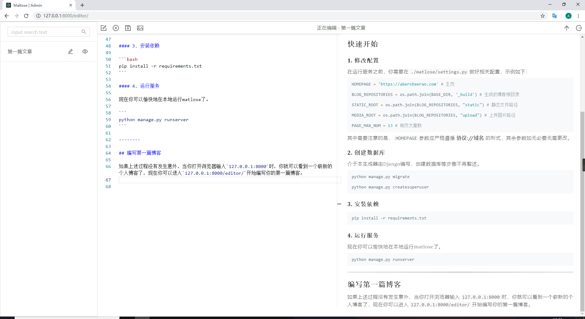

# Maltose

一个使用Django编写的静态博客生成器。



拥有如下功能

- [x] 内置图片管理
- [x] Makrdown编辑器 in web

## 快速开始

```
pip install maltose
```

### 使用

在你的博客目录下运行命令`maltose-cli migrate`用以创建数据库，如果目录下没有`maltose.json`配置，会询问你之后自动创建。

博客目录下必须存在`templates`，其中包含`articles`与`static`，前者包含所有页面的模板，后者包含所需要的静态文件。(可以使用现成的模板, 例如: https://github.com/MaltoseEditor/black-white )

使用`maltose-cli.py runserver`，你将能启动Django程序，你可以在`localhost:8000/editor/`中获得一个编辑器，用以书写博客。程序使用Django信号来创建用以发布到网络上的静态页面。

### 高级使用

你可以直接下载源码然后依照标准Django程序进行修改，使用`python setup.py install`可以安装你自己改修后的版本。

## 更多说明

……to be continue
